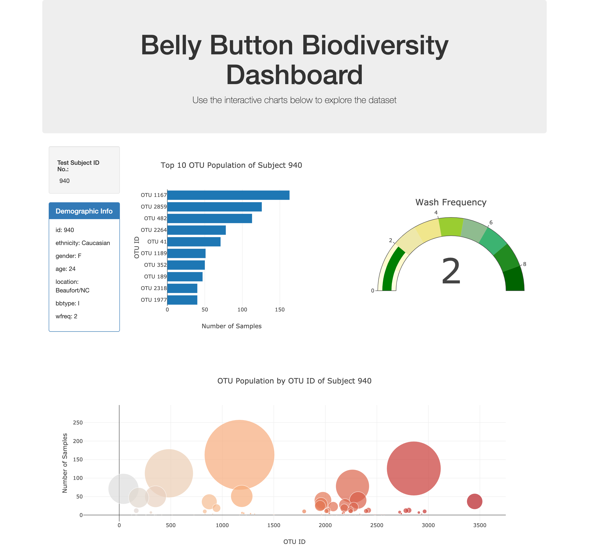

# Belly Button Biodiversity
A web dashboard is created to illustrate various charts depicting microbial species called operational taxonomic units, OTUs. This website is supported by HTML5, Bootstrap, CSS, and the D3 and Plotly library for JavaScript. For codes, please refer to the following documents:
* `static/js/app.js`
* `index.html`

You can access the dashboard by clicking [here](https://soobing91.github.io/A12_Biodiversity_App/index.html).

The screenshot below captures the web app:

